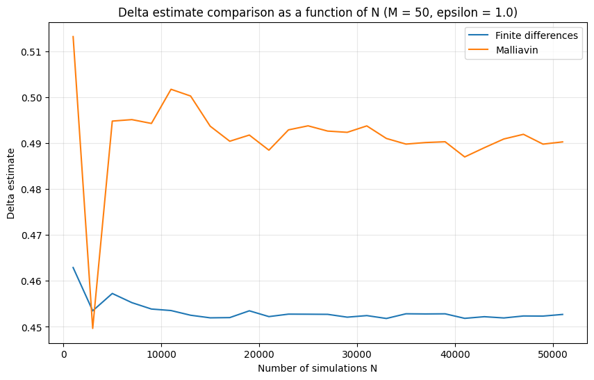
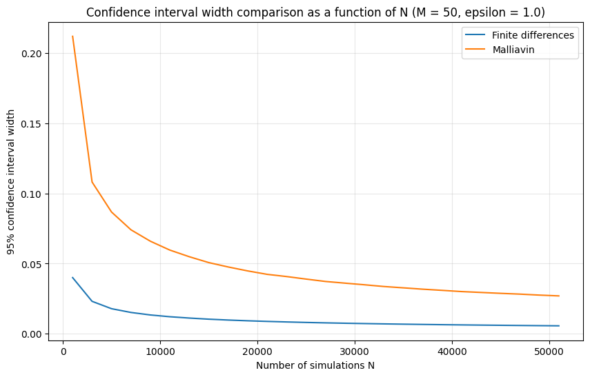

# Malliavin Calculus & Monte Carlo — Delta of a Path-Dependent Option in the Bachelier Model

*M2 MMMEF, Université Paris 1 Panthéon-Sorbonne — course "Malliavin calculus and Monte Carlo methods", Project E (March 2026).*

> **Headline.** This project derives a Malliavin integration-by-parts weight for the Delta of a path-dependent (Asian-barrier) payoff in the Bachelier model, proves that this weight is the minimum-variance weight in its class, and then measures it against centered finite differences with common random numbers. The honest numerical result is that the Malliavin estimator **loses**: its variance is **≈ 22× larger** and its 95 % confidence intervals **≈ 4.7× wider** for the same number of paths. The README explains why (the effective payoff is Lipschitz, so finite differences are already cheap), checks both estimators against closed forms, and traces the residual dependence of the Malliavin estimate on the time grid to an **O(1/M) discretisation bias** that a midpoint rule removes.

## Contents

1. [What the project does](#1-what-the-project-does)
2. [Mathematical setting](#2-mathematical-setting)
3. [Part A — Clark–Ocone representation](#3-part-a--clarkocone-representation)
4. [Part B — Malliavin weight for a path-dependent payoff](#4-part-b--malliavin-weight-for-a-path-dependent-payoff)
5. [Part C — Numerical study](#5-part-c--numerical-study)
6. [Sanity check against closed forms](#6-sanity-check-against-closed-forms)
7. [Why the Malliavin estimator loses here](#7-why-the-malliavin-estimator-loses-here)
8. [Follow-up: the O(1/M) bias of the discretised weight](#8-follow-up-the-o1m-bias-of-the-discretised-weight)
9. [Repository structure](#9-repository-structure)
10. [Reproducing the results](#10-reproducing-the-results)
11. [References](#11-references)

## 1. What the project does

| Part | Content | Where |
|---|---|---|
| A | Proof of the Clark–Ocone representation formula from the Malliavin duality and the martingale representation theorem; identification of the replicating strategy with Black–Scholes delta hedging | `Project_E_5_Crochemar.pdf`, §1 |
| B | Differentiability of the price of a payoff $\Phi\big(\int_0^T X_t\,dt,\,X_T\big)$; characterisation of admissible Skorokhod weights; explicit weight in the Bachelier model and proof of its optimality | `Project_E_5_Crochemar.pdf`, §2 |
| C | Monte Carlo pricing, Delta by finite differences, Delta by Malliavin weight, head-to-head comparison | `projectE_Crochemar_Theo.ipynb`, `Graphs/` |

## 2. Mathematical setting

Bachelier model with unit volatility on $[0,T]$:

$$X_t^x = x + B_t, \qquad x = 100,\quad r = 10\%,\quad T = 1 .$$

Payoff (Asian barrier on the running integral, call on the terminal value):

$$\Phi\Big(\int_0^T X_t^x\,dt,\; X_T^x\Big) = \mathbf{1}_{\{\int_0^T X_t^x dt < 110\}}\,(X_T^x - 100)^+ .$$

Price and Delta:

$$P(x) = e^{-rT}\,\mathbb{E}\Big[\Phi\Big(\int_0^T X_t^x dt,\,X_T^x\Big)\Big], \qquad \Delta(x) = P'(x).$$

The time integral is discretised on a uniform grid with $M$ steps, as required by the assignment:

$$\int_0^T X_t\,dt \;\approx\; \frac{T}{M}\sum_{k=0}^{M} X_{kT/M}, \qquad M \in \{50, 150, 250\}.$$

(The sum runs over the $M+1$ grid points, so its expected value is $x\,T\,(M+1)/M$; see §6 for why this has no visible effect here.)

## 3. Part A — Clark–Ocone representation

For $F$ in the Malliavin–Sobolev space $\mathbb{D}$:

$$F = \mathbb{E}[F] + \int_0^T \mathbb{E}[D_sF \mid \mathcal{F}_s]\,dB_s .$$

Proof structure:

1. The set $H = \{c + \int_0^T u_s\,dB_s\}$ is the whole of $L^2(\Omega)$ (martingale representation theorem + Itô isometry).
2. Reduction to the centred case $\mathbb{E}[F]=0$, since $D(F-\mathbb{E}F)=DF$.
3. For every $c + \int u\,dB \in H$, the duality $\mathbb{E}[F\,\delta(u)] = \mathbb{E}\big[\int_0^T D_sF\,u_s\,ds\big]$ and the tower property give $\mathbb{E}\big[F(c+\int u\,dB)\big] = \mathbb{E}\big[(\int v\,dB)(c+\int u\,dB)\big]$ with $v_s = \mathbb{E}[D_sF\mid\mathcal{F}_s]$.
4. $F - \int v\,dB$ is orthogonal to a dense subspace of $L^2$, hence zero.

Applications proved: the martingale version $M_t = \mathbb{E}[M_T] + \int_0^t \mathbb{E}[D_sM_T\mid\mathcal{F}_s]\,dB_s$, and, in the Black–Scholes model, the replicating strategy

$$H_t = \frac{\mathbb{E}[D_tF\mid\mathcal{F}_t]}{\sigma S_t e^{r(T-t)}},$$

which coincides with the usual delta hedge $H_t = \partial_x v(t,S_t)$ when $F=\Phi(S_T)$ with $\Phi \in C^1\cap\mathrm{Lip}$.

## 4. Part B — Malliavin weight for a path-dependent payoff

Write $A = \int_0^T X_s^x\,ds$, $B = X_T^x$, $\mathcal{G} = \sigma(A,B)$, and let $Y^x$ be the first-variation process.

* **(a) Differentiability.** $P \in C^1$ and, for $\Phi \in C^1\cap\mathrm{Lip}(\mathbb{R}^2)$,
  $\Delta(x) = e^{-rT}\,\mathbb{E}\big[\partial_1\Phi(A,B)\int_0^T Y_t^x\,dt + \partial_2\Phi(A,B)\,Y_T^x\big]$
  (mean-value formula + $L^2$ convergence of difference quotients + dominated convergence).
* **(b) Minimum-variance weight.** Let $\mathcal{W}$ be the set of weights $\Pi$ such that $\Delta(x) = e^{-rT}\mathbb{E}[\Phi(A,B)\Pi]$ for *all* admissible $\Phi$. Then $\Pi_0 = \mathbb{E}[\Pi\mid\mathcal{G}]$ is still in $\mathcal{W}$ and minimises $\mathrm{Var}(\Phi(A,B)\Pi)$ (law of total variance).
* **(c) Characterisation.** A Skorokhod integral $\Pi = \delta(w)$ belongs to $\mathcal{W}$ iff two conditional-moment identities hold given $\mathcal{G}$ (obtained from $D_sA$, $D_sB$, the chain rule and Fubini).
* **(d) Bachelier case.** With $Y\equiv 1$ and $\sigma\equiv 1$, the deterministic function $w_s = \tfrac{4}{T} - \tfrac{6}{T^2}s$ satisfies both identities, giving

$$\boxed{\;\Delta(x) = e^{-rT}\,\mathbb{E}\Big[\Phi(A,B)\,\Pi\Big],\qquad \Pi = \frac{4}{T}B_T - \frac{6}{T^2}\int_0^T s\,dB_s\;}$$

  and, by the integration-by-parts identity $\int_0^T s\,dB_s = TB_T - \int_0^T B_s\,ds$,

$$\Pi = \frac{6}{T^2}A - \frac{2}{T}B - \frac{4x}{T},$$

  so $\Pi$ is $\mathcal{G}$-measurable and therefore **already the optimal weight of (b)**. Note that $\Pi \sim \mathcal{N}(0, 4/T)$, since $\int_0^T w_s^2\,ds = 4/T$.

## 5. Part C — Numerical study

All estimators report the sample variance, the estimator variance, the standard error and a 95 % CLT confidence interval; convergence in $N$ is studied on $N \in \{1000, 3000, \dots, 51000\}$.

### 5.1 Price (`Question a`)

| $M$ | $N$ | $\hat P_N$ | Sample var. | Estimator var. | 95 % CI |
|---|---|---|---|---|---|
| 50  | 51 000 | 0.364212 | 0.2843 | $5.57\times10^{-6}$ | [0.3596, 0.3688] |
| 150 | 51 000 | 0.363835 | 0.2835 | $5.56\times10^{-6}$ | [0.3592, 0.3685] |
| 250 | 51 000 | 0.363415 | 0.2834 | $5.56\times10^{-6}$ | [0.3588, 0.3680] |

The discretisation level has no measurable effect on the price; the error is entirely statistical.

### 5.2 Delta by centred finite differences with common random numbers (`Question b`)

$$\hat\Delta^{FD}_{N,\varepsilon} = \frac{\hat P_N(x+\varepsilon) - \hat P_N(x-\varepsilon)}{2\varepsilon},$$

with the **same Brownian paths** for both terms.

| $M$ ($\varepsilon=1$) | $\hat\Delta^{FD}$ | Estimator var. | 95 % CI |
|---|---|---|---|
| 50  | 0.452692 | $2.08\times10^{-6}$ | [0.4499, 0.4555] |
| 150 | 0.452840 | $2.08\times10^{-6}$ | [0.4500, 0.4557] |
| 250 | 0.453044 | $2.07\times10^{-6}$ | [0.4502, 0.4559] |

Effect of $\varepsilon$ ($M=150$): the point estimate is flat (0.4525–0.4529 for $\varepsilon \in \{0.1, 0.25, 0.5, 1, 2\}$) while the estimator variance falls from $3.80\times10^{-6}$ to $0.94\times10^{-6}$. Section 6 explains why the estimate does not move with $\varepsilon$.

### 5.3 Delta by Malliavin weight (`Question c`)

$$\hat\Delta^{Mal}_N = \frac{e^{-rT}}{N}\sum_{i=1}^N \Phi\big(\hat A^{(i)}, X_T^{(i)}\big)\,\Pi^{(i)},\qquad \Pi^{(i)} = \frac{4}{T}B_T^{(i)} - \frac{6}{T^2}\sum_{k=0}^{M-1} t_k\,\Delta B_k^{(i)} .$$

### 5.4 Head-to-head ($N = 51\,000$, $\varepsilon = 1$) (`Question d`)

| $M$ | $\hat\Delta^{FD}$ | $\hat\Delta^{Mal}$ | $\widehat{\mathrm{Var}}(\hat\Delta^{FD})$ | $\widehat{\mathrm{Var}}(\hat\Delta^{Mal})$ | Var ratio | CI-width ratio |
|---|---|---|---|---|---|---|
| 50  | 0.452692 | 0.490259 | $2.08\times10^{-6}$ | $4.74\times10^{-5}$ | **22.8** | **4.77** |
| 150 | 0.452840 | 0.472527 | $2.08\times10^{-6}$ | $4.56\times10^{-5}$ | **21.9** | **4.68** |
| 250 | 0.453044 | 0.459891 | $2.07\times10^{-6}$ | $4.61\times10^{-5}$ | **22.3** | **4.72** |

<p align="center">
  
  
</p>

Two facts stand out: the Malliavin estimator is much noisier at every $N$, and — unlike finite differences — its level **moves with $M$** (0.490 → 0.473 → 0.460). Both are explained below.

## 6. Sanity check against closed forms

With unit volatility and $x=100$, the running integral satisfies $\int_0^T X_t\,dt \sim \mathcal{N}\big(100\,T,\, T^3/3\big)$, i.e. a standard deviation of $\approx 0.58$ against a barrier $10$ units away. The barrier is therefore never active ($\mathbb{P} \approx 10^{-67}$), and the same holds for the discretised integral. In this parametrisation the "complex Asian option" reduces numerically to an **at-the-money Bachelier call**, for which everything is explicit:

$$P = e^{-rT}\,\frac{\sqrt{T}}{\sqrt{2\pi}} = 0.36098,\qquad \Delta = \frac{e^{-rT}}{2} = 0.45242 .$$

* **Price:** every 95 % CI in §5.1 contains 0.36098. ✔
* **FD Delta:** every CI in §5.2 contains 0.45242. ✔ Moreover the centred difference is *exactly* unbiased here for any $\varepsilon$, because the Bachelier call satisfies $P(x+\varepsilon) - P(x-\varepsilon) = e^{-rT}\varepsilon$ at the money — which is why Table 3 of the report shows $\varepsilon$ changing the variance but not the estimate.
* **Malliavin Delta:** the $M=50$ estimate $0.490 \pm 0.013$ does **not** contain 0.45242; $M=150$ is borderline; $M=250$ ($0.460 \pm 0.013$) does. The estimator is unbiased in continuous time but carries a discretisation bias — quantified in §8.

This check is not in the original report; it was added afterwards and reframes the numerical part: the experiment does not test the Malliavin weight on an irregular payoff, but on a Lipschitz one.

## 7. Why the Malliavin estimator loses here

1. **The payoff is effectively Lipschitz.** The digital component $\mathbf{1}_{\{A<110\}}$ never switches, so the estimator differentiates $(X_T-100)^+$. For a Lipschitz payoff, the common-random-numbers difference $\big[(B_T+\varepsilon)^+ - (B_T-\varepsilon)^+\big]/2\varepsilon$ is bounded in $[0,1]$: its variance stays bounded as $\varepsilon \to 0$ (sample variance 0.19 at $\varepsilon = 0.1$, Table 3). Malliavin weights earn their keep on *discontinuous* payoffs, where the CRN-FD variance blows up like $1/\varepsilon$; that regime is simply not reached in this experiment.
2. **The weight is optimal only within $\mathcal{W}$.** Optimality in (b) is over weights valid for *every* admissible $\Phi$. It says nothing against payoff-specific estimators such as pathwise/CRN differentiation, which is what finite differences approximate here.
3. **Variance arithmetic.** $\Pi \sim \mathcal{N}(0,4)$ multiplies a payoff whose second moment is $\mathbb{E}[((B_T)^+)^2] = 1/2$; the sample variance of $e^{-rT}\Phi\Pi$ is measured at 2.48, versus 0.106 for the CRN difference at $\varepsilon = 1$ — a ratio of ≈ 23, consistent with the table.

Standard remedies not implemented here: **localisation** of the weight around the kink (Fournié et al., 2001), control variates using $\Pi$ itself (since $\mathbb{E}[\Pi]=0$), or using the weight only for the non-smooth part of the payoff.

## 8. Follow-up: the O(1/M) bias of the discretised weight

The stochastic integral in $\Pi$ is discretised with a **left-point** Itô sum, $\sum_k t_k\,\Delta B_k$. Its error is $e = \frac{6}{T^2}\sum_k \int_{t_k}^{t_{k+1}} (s - t_k)\,dB_s$, a centred Gaussian that is **correlated with the payoff**. Because $(B_T, e)$ is jointly Gaussian and $\Phi$ depends on $B_T$ only,

$$\mathbb{E}[\Phi\,e] = \frac{\mathbb{E}[\Phi\,B_T]}{T}\cdot \frac{6}{T^2}\sum_k\int_{t_k}^{t_{k+1}}(s-t_k)\,ds = \frac{6}{T^2}\cdot\frac{T/2}{T}\cdot\frac{T^2}{2M},$$

so that

$$\mathrm{bias}\big(\hat\Delta^{Mal}\big) = e^{-rT}\,\frac{3}{2M} \;\approx\; \frac{1.36}{M}.$$

| $M$ | Predicted bias | Observed $\hat\Delta^{Mal} - 0.45242$ (report, ± CI half-width) |
|---|---|---|
| 50  | 0.027 | 0.038 ± 0.013 |
| 150 | 0.009 | 0.020 ± 0.013 |
| 250 | 0.005 | 0.007 ± 0.013 |

Replacing $t_k$ by the **midpoint** $t_{k+1/2}$ makes $\int_{t_k}^{t_{k+1}}(s-t_{k+1/2})\,ds = 0$ and kills the first-order term. `malliavin_weight_bias_check.py` reruns the estimator with $N = 400\,000$ paths under both rules:

| $M$ | Left-point rule | Midpoint rule | Closed form |
|---|---|---|---|
| 50  | 0.4779 ± 0.0048 | 0.4529 ± 0.0047 | 0.4524 |
| 150 | 0.4638 ± 0.0047 | 0.4527 ± 0.0047 | 0.4524 |
| 250 | 0.4548 ± 0.0046 | 0.4557 ± 0.0047 | 0.4524 |

The left-point estimates sit at the predicted offsets; the midpoint estimates are unbiased at all three grids. The variance is unchanged — the fix removes the bias, not the noise.

## 9. Repository structure

```
.
├── README.md
├── Project_E_5_Crochemar.pdf          # full write-up: proofs (Parts A–B) and numerical report (Part C)
├── projectE_Crochemar_Theo.ipynb      # all Monte Carlo code, sections "Question a) … d)"
├── malliavin_weight_bias_check.py     # follow-up experiment of §8 (left-point vs midpoint rule)
└── Graphs/                            # figures exported from the notebook
    ├── monte_carlo_price_question_a.png, estimator_variance.png
    ├── finite_diff_delta_estimate.png, effect_of_espsilon.png, ...
    ├── mal_delta.png, width_ic_95.png
    └── delta_esti_comp_m{50,150,250}.png, esti_var_fct_nm{50,150,250}.png, ci_width_nm{50,150,250}.png
```

Notebook layout: `Question a)` price estimator and convergence in $N$; `Question b)` finite differences, effect of $M$ and $\varepsilon$; `Question c)` Malliavin weight; `Question d)` comparison tables and figures. Random seeds are fixed (`seed=42` for the single-run checks, `seed=123` for the convergence study).

## 10. Reproducing the results

```bash
pip install numpy pandas matplotlib jupyter
jupyter notebook projectE_Crochemar_Theo.ipynb   # run all cells, ~2 min on a laptop
python malliavin_weight_bias_check.py            # §8 table, ~20 s
```

## 11. References

* Fournié, E., Lasry, J.-M., Lebuchoux, J., Lions, P.-L., Touzi, N. (1999). *Applications of Malliavin calculus to Monte Carlo methods in finance.* Finance and Stochastics 3, 391–412.
* Fournié, E., Lasry, J.-M., Lebuchoux, J., Lions, P.-L. (2001). *Applications of Malliavin calculus to Monte Carlo methods in finance II.* Finance and Stochastics 5, 201–236.
* Nualart, D. (2006). *The Malliavin Calculus and Related Topics.* Springer.
* Glasserman, P. (2004). *Monte Carlo Methods in Financial Engineering.* Springer — ch. 7 on sensitivity estimation.
